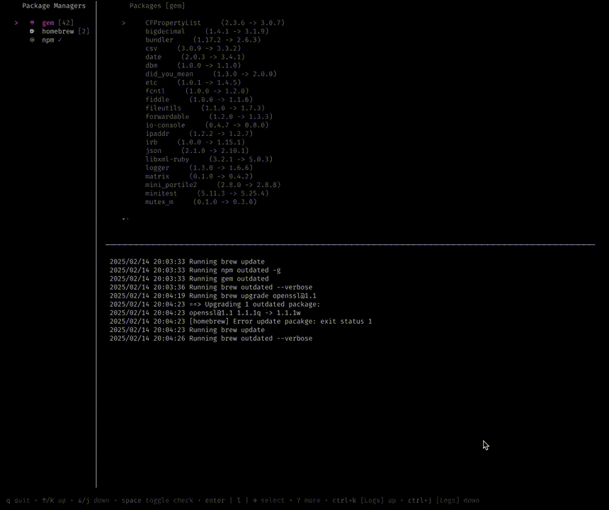
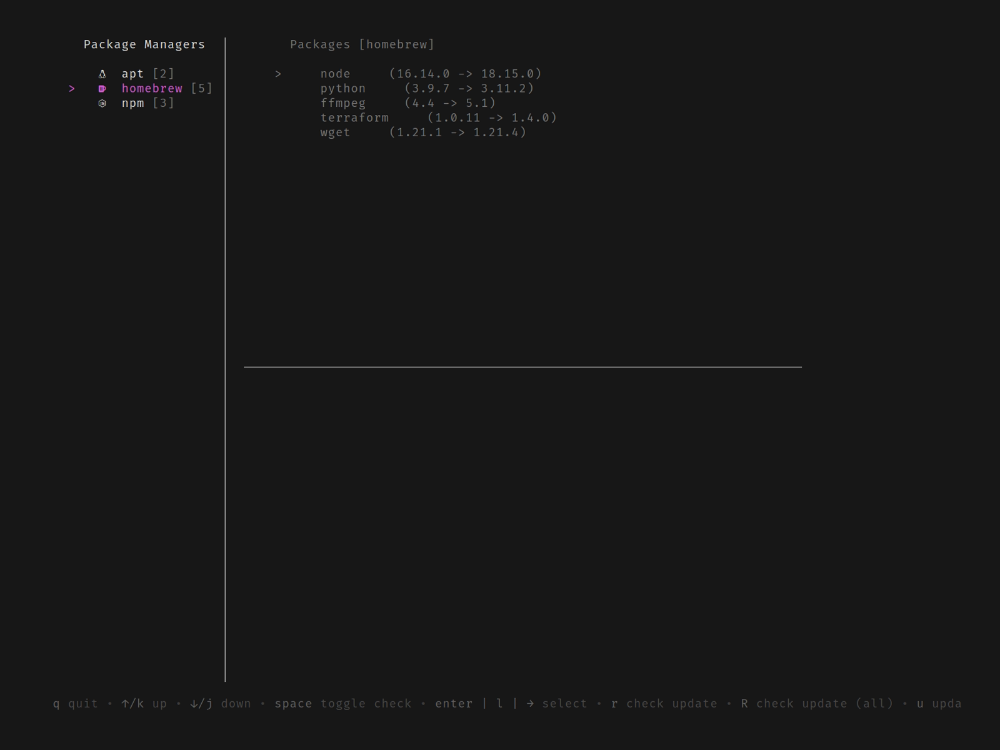
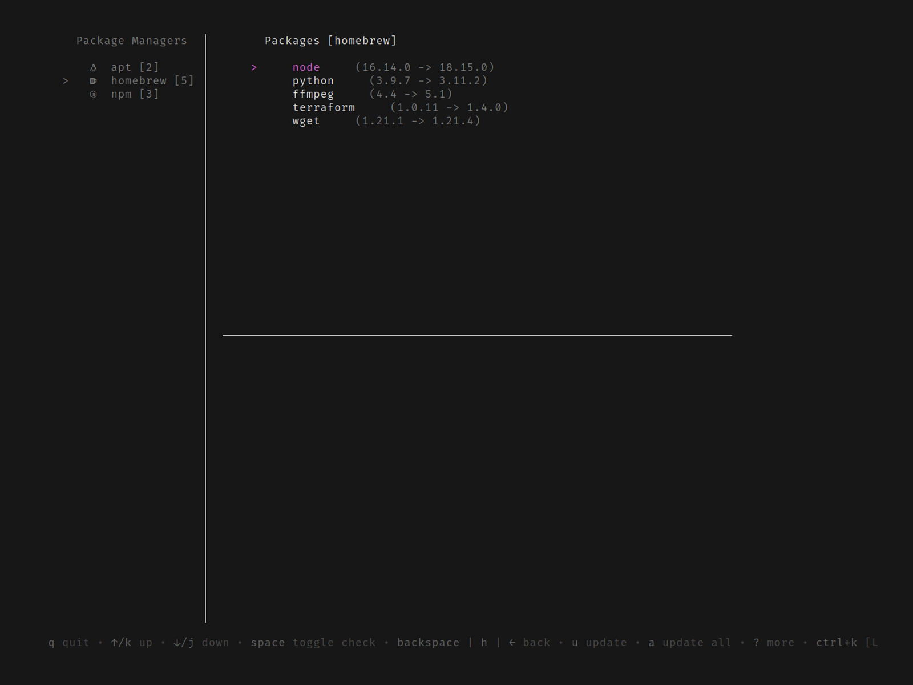
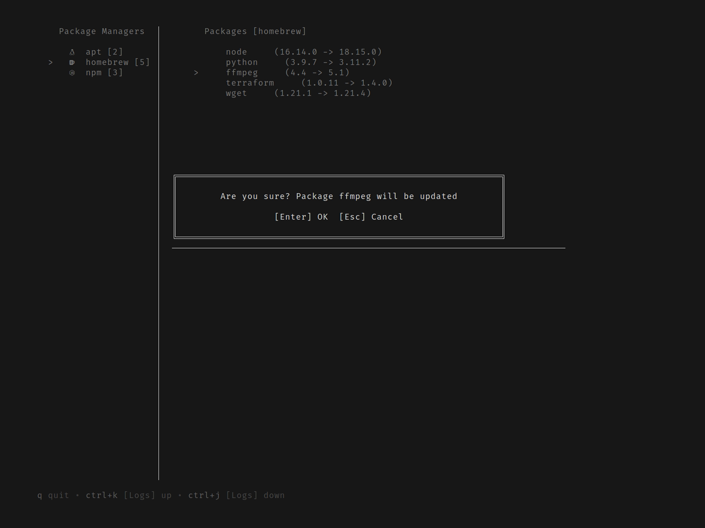

# lazypkg

> [!NOTE]
> 🚧 This project is in an early development phase.

A terminal application for managing packages across different package managers.

Currently supported package managers:

- apt
- docker
- gem
- homebrew
- npm



Options:

```
A TUI package management application across package managers

Usage:
  lazypkg [flags]

Flags:
      --dry-run               Perform update commands with --dry-run option
      --exclude stringArray   Package manager name to be excluded in lazypkg
  -h, --help                  help for lazypkg
  -v, --version               version for lazypkg
```

## Keymap

#### Package Managers List (Side Bar)
| Key            | Action |
|---------------|--------|
| `↑` / `↓` / `j` / `k` | Move cursor |
| `Enter` / `l` / `→` | Select and enter Packages list |
| `r` | Check for updates (current package manager) |
| `R` | Check for updates (all package managers) |
| `Space` | Multi-select |
| `u` | Update packages (current or selected package managers) |

#### Packages List
| Key            | Action |
|---------------|--------|
| `↑` / `↓` / `j` / `k` | Move cursor |
| `Backspace` / `h` / `←` | Return to Package Managers List |
| `Space` | Multi-select |
| `u` | Update packages (current or selected) |
| `U` | Update all displayed packages |

#### Global
| Key            | Action |
|---------------|--------|
| `q` | Quit |
| `Ctrl+j` / `Ctrl+k` | Scroll logs |

## Getting Started

### Prerequisite

While not strictly required, having [Nerd Fonts](https://www.nerdfonts.com/) installed enhances the visual appearance of the interface.

### Installation

#### Homebrew

```
$ brew install ymtdzzz/tap/lazypkg
```

#### go install

```
$ go install github.com/ymtdzzz/lazypkg@latest
```

### Basic Usage

When you launch `lazypkg`, it automatically checks for package updates.

> [!NOTE]
> If a package manager requires administrator privileges (e.g., apt), a password prompt will be displayed.



The sidebar supports common navigation methods (`down/j`, `up/k`).

You can review the update status of each package. Press `u` to update all packages for the currently selected package manager. You can also select multiple package managers with `space` and then press `u` to update all selected managers at once.

> [!NOTE]
> Before executing any action that makes changes, a confirmation dialog will be displayed for safety.

If you want to update packages individually, navigate to the package list by pressing `enter/l/right` in the sidebar.



Here, you can see a list of updatable packages.

To update a specific package, press `u` while it is selected.



Once the update is complete, the list refreshes automatically.

> [!IMPORTANT]
> Even if you update a single package, dependencies might be updated as well, depending on the package manager.

You can also update multiple packages by selecting them with `space` and pressing `u`, or update all packages at once with `a`.

For additional key mappings, check the help section at the bottom of the screen.

<!-- TODO: Uncomment when ready e.g. Contribution Guide
## Contribution

Contributions are always welcome! Whether it's reporting an issue, suggesting a feature, or submitting a pull request, your involvement is greatly appreciated. Below is a simple guide to help you get started.

### Creating a Pull Request

#### Fork the Repository

- Start by forking this repository to your GitHub account.

#### Make Your Changes

- Implement your changes in a new branch.

#### Write Tests

- Add tests to verify your changes. This helps ensure the stability of the project.
- We currently lack sufficient test coverage, so contributions that add tests are also highly welcome!

#### Run Lint Checks and Tests

- Run the linting tools and test suite to verify your changes. Make sure everything passes before proceeding.

```
make lint
make test
```

#### Open a Pull Request

- Push your branch to your forked repository.
- Open a pull request to the main repository, providing a clear description of your changes and their purpose.

Thank you for taking the time to contribute!

-->
